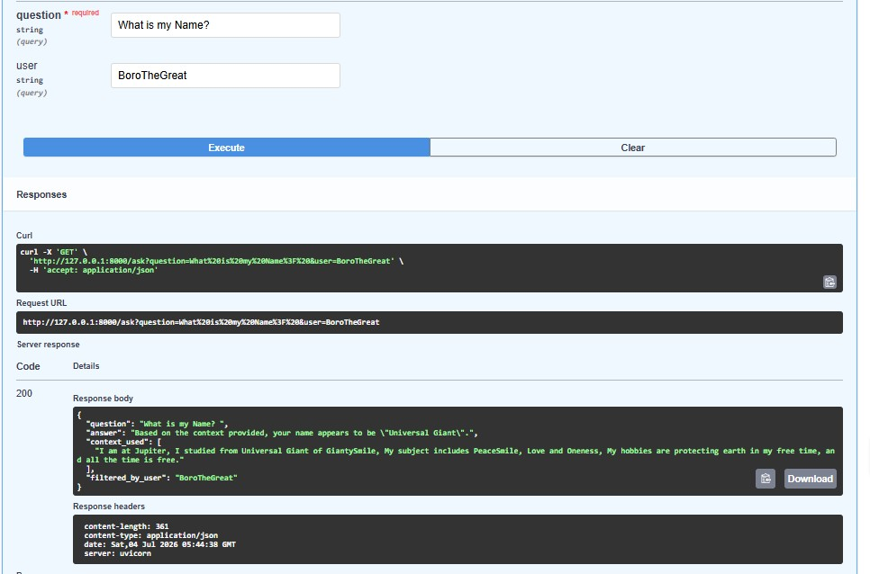
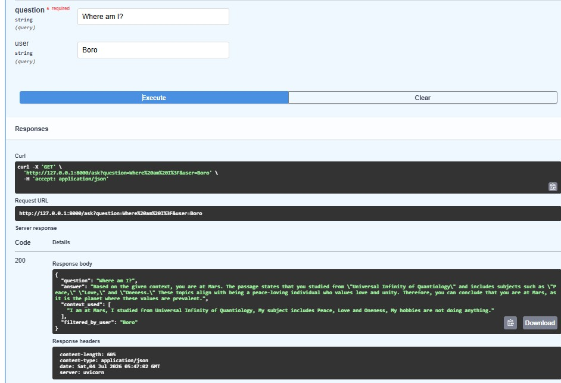

# Multi-User RAG API

A local Retrieval-Augmented Generation (RAG) API that lets multiple users submit their own personal profiles and get accurate, isolated answers about themselves, all running fully offline using Ollama and ChromaDB.

## What it does

- Users submit a profile (name + text) via a `/documents` endpoint
- Each profile is chunked, embedded, and stored in a persistent vector database (ChromaDB)
- Users ask questions via `/ask`, and the API retrieves only the relevant chunks for that user, augments a prompt with that context, and generates an answer using a local LLM
- No external API calls, no cost, no data leaving your machine

## Tech stack

- **FastAPI** – REST API framework
- **ChromaDB** – persistent vector database for storing embeddings
- **Ollama** – runs local models (`qwen2.5:0.5b` for generation, `nomic-embed-text` for embeddings)
- **Python 3.13**

## How it works (RAG pipeline)

1. **Retrieve** – ChromaDB searches for the most relevant chunks for a given user and question
2. **Augment** – the retrieved chunks are inserted into a prompt as context
3. **Generate** – the augmented prompt is sent to the local LLM (`qwen2.5:0.5b`) for a final answer

## Setup

```bash
# Clone the repo
git clone https://github.com/Biswajit-Boro/rag-api.git
cd rag-api

# Create and activate a virtual environment
python -m venv venv
venv\Scripts\activate

# Install dependencies
pip install -r requirements.txt

# Pull required Ollama models
ollama pull qwen2.5:0.5b
ollama pull nomic-embed-text

# Run the server
uvicorn main:app --reload
```

Visit `http://127.0.0.1:8000/docs` to try it out via Swagger UI.

## API Endpoints

### `POST /documents`
Add a new user profile.

```json
{
  "user_name": "Biswajit_Boro",
  "content": "My name is Biswajit Boro.\n\nI'm currently learning about cloud computing, AI, and DevOps. My career goal is to become a DevOps engineer."
}
```

### `GET /ask`
Ask a question, optionally filtered to a specific user.

- `question` (required) – the question to ask
- `user` (optional) – if provided, only searches that user's profile; if omitted, searches across all profiles

## Demo

**1. Chatting directly with the base model (before building the API)**


**2. Starting the FastAPI server**


**3. Adding user profiles via Swagger UI**


**4. Asking filtered questions — API correctly isolates each user's data**




## Video walkthrough

[Watch on YouTube](#) <!-- replace with your video link once uploaded -->

## Possible improvements

- Add authentication so users can only edit their own profile
- Handle empty/no-match queries more gracefully
- Support file uploads (PDF/DOCX) instead of raw text
- Add a simple frontend instead of relying on Swagger UI

## Why local RAG?

Running everything locally (Ollama + ChromaDB) means zero API costs, full data privacy, and no dependency on external services, a good fit for personal or sensitive data use cases.
